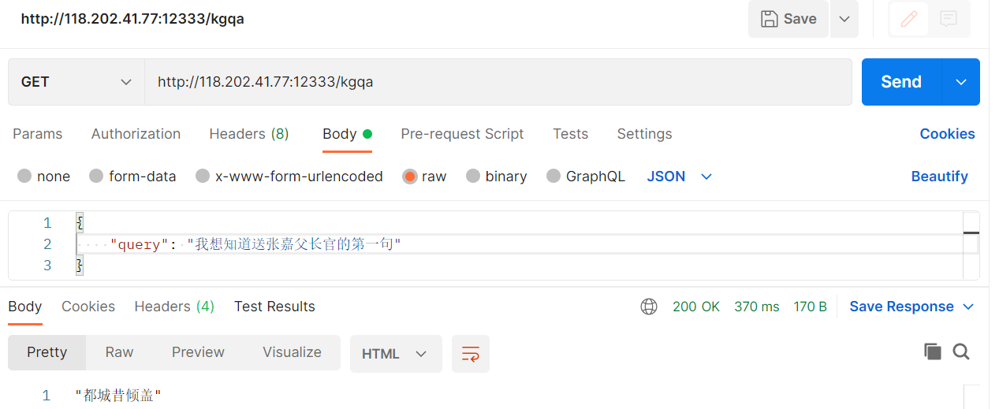
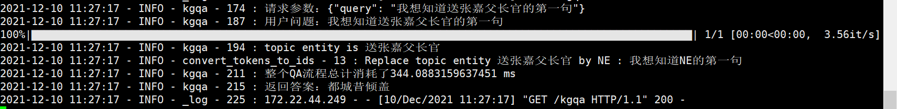

# 基于TransferNet模型实现的问答服务



118.202.41.77是我主机的ip地址。

后台日志：




# 问答服务的构建
```bash
pip install -r requirements.txt
```
## 数据处理

### 数据与预训练模型的准备
数据采用nlpcc2018评测的数据，(官网：http://tcci.ccf.org.cn/conference/2018/taskdata.php 选择task7 Open Domain Question Answering，即可下载数据集。数据集包含知识图谱和问答数据)
我们需要用到的文件有：
- nlpcc2018.kbqg.train
- nlpcc-iccpol-2016.kbqa.kb

需要用到一个预训练模型，可以去huggingface上下载，我用的是chinese-roberta-wwm

### 问答对数据以及知识图谱的构建

我们利用kbqg.train数据构造实体识别数据集，同时构造问答对数据集。
之后利用问答对数据集从大规模的知识图谱kbqa.kb中筛选一部分实体和关系，构造一个小规模的知识图谱。

关于问答对数据和知识图谱的构建详见：../notebook/TransferNet/1-数据处理.ipynb

## 模型训练

### NER模型的训练
NER模型的训练见：../notebook/实体识别模型的训练.ipynb

### KGQA模型的训练
```bash
cd TransferNet
python train.py --knowledge_dir a --qa_dir b --save_dir c --bert_name d
```
其中
- a 表示知识图谱的路径(构造的小规模知识图谱)
- b 表示问答对数据的路径(构造的问答对数据)
- c 表示保存训练模型的路径
- d 表示下载的预训练模型的路径

## 服务构建
app.py是服务启动的文件，代码中的几个路径变量需要修改成你自己本地的，其中包括：
- kg_folder='/home/xhsun/Desktop/KG/nlpcc2018/knowledge/small_knowledge/'
- bert_name='/home/xhsun/Desktop/huggingfaceModels/chinese-roberta-wwm/'
- save_model_path = '/home/xhsun/Desktop/code/KG/TransferNet-master/save_dir/model.pt'
- ner_model_path='/home/xhsun/Desktop/notebook/TransferNet/NER'


- kg_folder是知识图谱的路径(构造的小规模知识图谱)
- bert_name是下载的预训练模型的路径
- save_model_path是KGQA模型训练后保存的路径
- ner_model_path是NER模型训练后保存的路径

启动方式：
```bash
python app.py
```

可以在app.run(debug=True,host='0.0.0.0',port='12333',use_reloader=False)中指定端口
